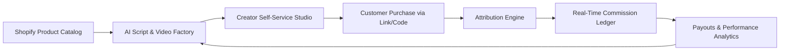
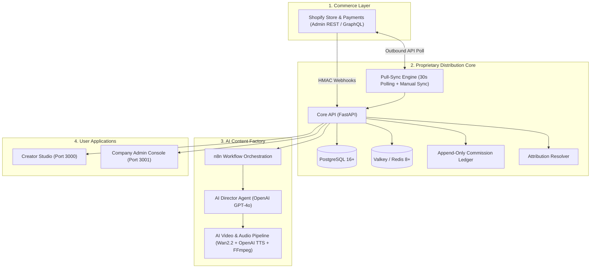

# Shopify AI Distribution OS
### Automated Commerce Distribution & AI Content Generation Platform

[](https://opensource.org/licenses/MIT)
[](https://shopify.dev/docs/api/admin-graphql)
[](https://www.postgresql.org/)
[](https://docs.docker.com/compose/)

---

## 1. Overview

**Shopify AI Distribution OS** is a high-performance commerce distribution engine designed to scale product sales across digital channels through automated creator enablement, multi-evidence sales tracking, and double-entry commission accounting.

The platform directly integrates with **Shopify** for product catalog synchronization and checkout processing, leverages an **AI Content Factory** (LLM Scripting + Automated 9:16 Video Generation + Voiceover) for content production, and maintains an **Append-Only Financial Ledger** with automatic proportional refund reversals.



---

## Development Progress (PoC Phase 1)

✅ **Day 1:** Database Schema, Backend Skeleton, Security Standards
✅ **Day 2:** Webhook Infrastructure & Idempotency
✅ **Day 3:** Redirect Gateway & Attribution Engine
✅ **Day 4:** Append-Only Commission Ledger & Reversals
✅ **Day 5:** AI Director Agent (LangGraph + OpenAI GPT-4o) & Telemetry
✅ **Day 6:** Cloud AI Video & Audio Rendering Factory
✅ **Day 7:** Creator Studio & Admin Console
✅ **Day 8:** Production VPS Deployment & Live Demo Presentation

---

## 2. Core Architectural Features

### 🛒 Commerce & Payments (Shopify Native)
### 🛒 Commerce & Payments (Shopify Native)
* **Zero Customer Fund Custody:** Customer payments and refunds are 100% processed by Shopify Payments directly into the merchant bank account. The system acts solely as an internal accounting ledger for creator commissions.
* **Resilient Hybrid Ingestion:** 
  * **Zero-Tunnel Pull-Sync:** Automatically queries Shopify Admin REST API (`2024-01`) every 30 seconds (and via manual "Sync Now" trigger) to ingest paid orders and refunds with 100% reliability, immune to public tunnel drops and SSL hurdles.
  * **Hardened Push Webhooks:** Constant-time multi-secret HMAC-SHA256 verification and idempotency deduplication (`X-Shopify-Webhook-Id`) across `orders/paid`, `refunds/create`, and `products/update`.

### 🔗 Deterministic Sales Attribution
* **Fast Redirect Gateway (`/r/{slug}`):** High-speed URL redirection with visitor session hashing, UTM capture, and signed referral tokens.
* **Coupon Attribution Resolver:** Deterministic discount code mapping (e.g., checkout with code `ALEX10` attributes 100% of the sale to Creator Alex).
* **Multi-Evidence Priority:** `Promo Code > Signed Referral Token > Last Click Event`.

### 📒 Append-Only Double-Entry Commission Ledger
* **Real-Time Accruals:** Automatically computes creator commissions (e.g., +20% `EARN` entry) upon order payment.
* **Proportional Refund Reversals:** Accurately deducts commissions on partial or full order refunds (e.g., -$80 reversal on a $400 partial refund of a $1,000 order) without destructive database updates.
* **Audit Trail:** Immutable ledger entries with complete timestamp and transaction tracking.

### 🎬 AI Content & Video Factory
* **AI Director Agent:** Automated prompt pipeline generating high-converting 3-second hooks, 20-second scripts, visual scene pacing, and compliant `#Ad` / `#Sponsored` disclosures.
* **Automated 9:16 Short Video Rendering:** Renders 720x1280 vertical video clips with AI voiceover narration and auto-generated subtitles.

### 🖥️ User Applications
* **Creator Studio Web App:** Portal for creators to view daily tasks, preview/download AI videos and scripts, manage referral links/codes, and inspect live earnings.
* **Company Admin Console:** Management interface for product catalog settings, configurable commission rates, live transaction ledger audits, and one-click "Sync Shopify Orders" button.

---

## 3. Technology Stack



| Layer | Technologies |
|---|---|
| **Backend & Core API** | Python 3.11+ / 3.13 (FastAPI), SQLAlchemy Async, Pydantic |
| **Commerce Ingestion** | Shopify Admin REST API (`2024-01`), 30s Polling Daemon & Webhooks |
| **Databases** | PostgreSQL 16 (Primary Ledger via Docker), Valkey / Redis (Cache & Locks) |
| **AI Content** | OpenAI (GPT-4o), OpenAI Audio (TTS), Wan2.2 (Fal.ai) |
| **Media Processing** | FFmpeg 6.0+ |
| **Frontend Portals** | Next.js / React, Vanilla CSS Glassmorphism |
| **Infrastructure** | Docker Desktop (Windows) / Docker Compose (Linux VPS) |

---

## 4. Getting Started (Local Development)

### Prerequisites
* [Docker Desktop for Windows](https://docs.docker.com/desktop/install/windows-install/) (WSL 2 backend enabled)
* [Python](https://www.python.org/) 3.11+ to 3.13
* [Node.js](https://nodejs.org/) v20+ or v24
* Shopify Development Store with Custom App credentials

### Quick Start (One-Click PowerShell Setup)

Run the included automated setup script from the project root:
```powershell
.\scripts\setup_local_env.ps1
```
*(Runs virtual environment setup, pip installs, and starts PostgreSQL 16 & Valkey 8 Docker containers automatically).*

### Starting the Services (3 Terminal Tabs)

1. **Terminal 1: Core API & Background Sync Scheduler**
   ```powershell
   .\.venv\Scripts\uvicorn.exe main:app --app-dir src/apps/core-api --reload --port 8000
   ```

2. **Terminal 2: Creator Studio (Port 3000)**
   ```powershell
   cd src/apps/creator-web
   npm run dev
   ```

3. **Terminal 3: Admin Console (Port 3001)**
   ```powershell
   cd src/apps/admin-web
   npm run dev
   ```

### Verification & Automated Testing

Run the full automated test suite covering all 5 core financial accounting scenarios and security guards:
```powershell
.\.venv\Scripts\pytest.exe -v
```
**Result:** `29 passed in ~5.0s (100% pass rate across 10 test modules)`

### Local Service Dashboard

| Portal / Service | Local URL | Description |
|---|---|---|
| **Creator Studio** | [`http://localhost:3000`](http://localhost:3000)<br>Earnings: [`http://localhost:3000/earnings`](http://localhost:3000/earnings) | Tasks, video scripts, coupon codes, and 20% commission earnings |
| **Admin Console** | [`http://localhost:3001`](http://localhost:3001) | Live transactional audit ledger, "↻ Sync Shopify Orders" button, AI metrics |
| **Core API & Swagger** | [`http://localhost:8000/docs`](http://localhost:8000/docs) | Interactive Swagger UI & OpenAPI documentation |
| **PostgreSQL Database** | `localhost:5432` | DB: `distribution_db`, User: `distribution_user` |
| **Valkey / Redis Cache** | `localhost:6379` | High-speed cache for idempotency keys & rate limiting |

---

## 5. Security & Privacy Standards

* **HMAC Verification:** All incoming webhook payloads are strictly validated against `X-Shopify-Hmac-SHA256`.
* **Zero Credential Exposure:** Secrets, API keys, and sensitive tokens are strictly managed via environment variables.
* **Privacy by Design:** Visitor IP addresses are salted and hashed (`ip_hash`) before storage for compliance with global privacy regulations.
* **Immutable Accounting:** Ledger operations are append-only to prevent financial tampering.

---

## 6. License

This project is licensed under the [MIT License](LICENSE).
